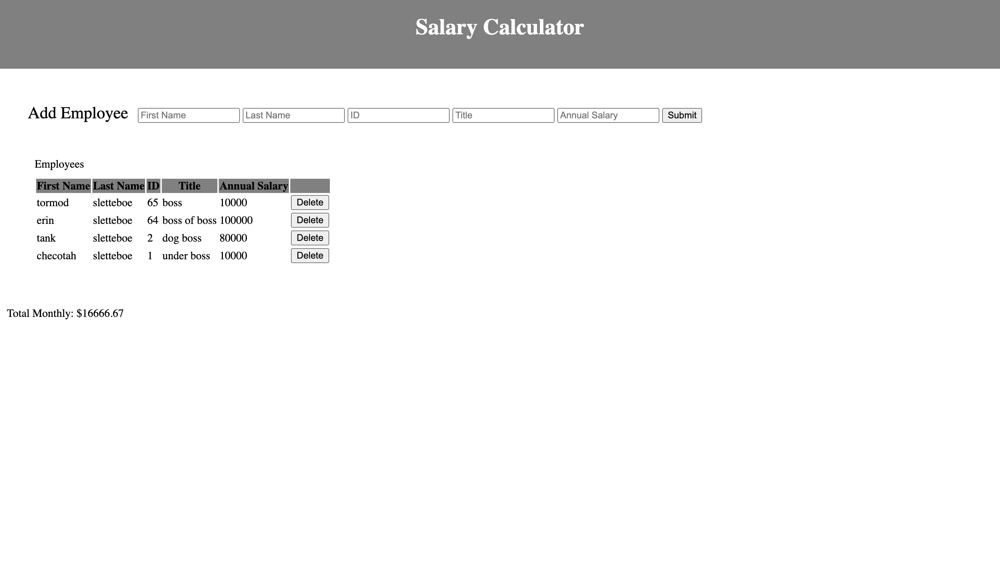

# Salary Calculator

## Description

_Duration: 2 Day Sprint_

Salary Calculator helps the user manage the total monthly salary cost. Simply input all employees and their corresponding data required by the program and click submit. A total montly cost will be calculated after every new employee added. Should an employee quit simply delete them from the table and the new monthly cost will be calculated.

## Screen Shot

User simply fills in "all" Add Employee inputs and click the submit button. The Employee will then be added to a table and a total montly cost will be calculated. The user can add as many employees to the table as they desire. Additionally the user can remove an employee by clicking the corresponding employee delete button.
If the total monthly cost exceeds $20,000 USD the label background color will change to red. If the user then removes an employee and the monthly cost drops below $20,000 USD, the background changes back to white. See image below.

### Prerequisites

Link to software that is required to install the app (e.g. node).

- [javascript](https://www.javascript.com/)
- [css]
- [html]
- [jquery]
- [git](https://git-scm.com/)
- [github](https://github.com/)

## Installation

How do you get your application up and running? This is a step by step list for how another developer could get this project up and running. The good target audience in terms of knowledge, would be a fellow Primer from another cohort being able to spin up this project. Note that you do not need a paragraph here to intro Installation. It should be step-by-step.

If your application has secret keys (for example --  Twilio), make sure you tell them how to set that up, both in getting the key and then what to call it in the `.env` file.

1. Create a database named `your database name`,
2. The queries in the `tables.sql` file are set up to create all the necessary tables and populate the needed data to allow the application to run correctly. The project is built on [Postgres](https://www.postgresql.org/download/), so you will need to make sure to have that installed. We recommend using Postico to run those queries as that was used to create the queries, 
3. Open up your editor of choice and run an `npm install`
4. Run `npm run server` in your terminal
5. Run `npm run client` in your terminal
6. The `npm run client` command will open up a new browser tab for you!

## Usage

1. Type in first name, last name, ID, title and annual salary.
2. Click the submit button.
3. An Employee will then be added to the table and a Total Monthly Cost will be calculated.
4. User can add more employees to the table by filling in the inputs and clicking submit again.
5. A new employee will then be added to the table and a Total Monthly Cost will be calculated.
6. If Total Monthly Cost exceeds $20,000 USD, that labels background color will change to red.
7. To get the Total Monthly Cost below $20,000 USD, an employee or multiple employees have to be deleted from the table.
8. Simply click the delete button of the employee to remove. That employee will be removed from the table and a new Total Monthly Cost will be calculated. If the new Total Monthly Cost drops below $20,000 USD the background color will change back to white.

## Built With

javascript, css, html, jquery, git and github.com

## Acknowledgement
Thanks to [Prime Digital Academy](www.primeacademy.io) who equipped and helped me to make this application a reality. (Edan Schwartz, Liz Kerber, Daniel Legan, Tia Theisen and Alina Trukhina)

## Support
If you have suggestions or issues, please email me at [tormod.slettebo@gmail.com]

